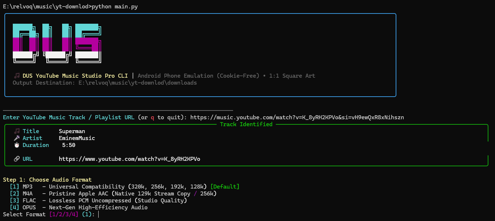
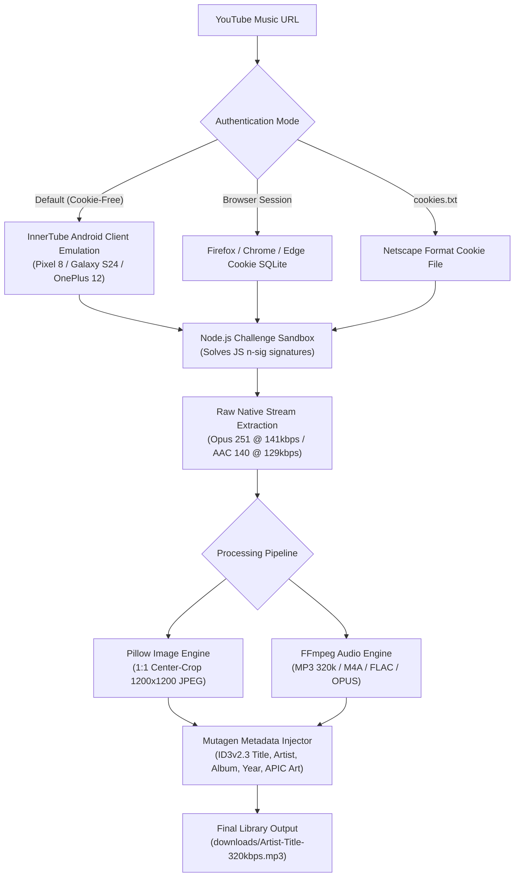

<div align="center">

# 🎵 YouTube Music Studio Pro CLI

<p align="center">
  <strong>High-Fidelity Audio Archival Studio & Personal Media Backup Utility</strong><br />
  <em>For Personal Content Backups & Creative Commons Media • 4-in-1 Transcoding Engine • 1:1 Square Album Art • Lossless Tagger</em>
</p>

<p align="center">
  <a href="https://github.com/dusmamud/youtube-music-downloader/actions/workflows/ci.yml">
    
  </a>
  
  <a href="LICENSE">
    
  </a>
  <a href="DISCLAIMER.md">
    
  </a>
  
  
  
  
</p>

<p align="center">
  <a href="#-interactive-studio-ui"><strong>Interactive Studio</strong></a> •
  <a href="#-key-features"><strong>Key Features</strong></a> •
  <a href="#-quick-start"><strong>Quick Start</strong></a> •
  <a href="#-cli-cheat-sheet"><strong>CLI Recipes</strong></a> •
  <a href="#-architecture"><strong>Architecture</strong></a> •
  <a href="#-documentation-hub"><strong>Documentation</strong></a> •
  <a href="#-legal-disclaimer--terms-of-use"><strong>Legal Disclaimer</strong></a>
</p>

---

<p align="center">
  
</p>

</div>

> [!IMPORTANT]
> **LEGAL NOTICE & FAIR USE ARCHIVAL POLICY:**
> This utility is designed strictly for **personal backup and archival of your own original content** or media licensed under permissive **Creative Commons / Public Domain** terms. Downloading copyrighted material without the explicit consent of the copyright owner is prohibited. This software does **not** bypass or decrypt DRM (Digital Rights Management) protections. Please review [**DISCLAIMER.md**](DISCLAIMER.md) before use.

## 🌟 Interactive Studio UI

Experience a terminal workflow inspired by modern developer tooling. No complex CLI flags required — simply run `python main.py` or `yt-music-dl`:

```text
┌─────────────────────────────────────────────────────────────────────────────┐
│                                                                             │
│  ██████╗  ██╗   ██╗ ███████╗                                                │
│  ██╔══██╗ ██║   ██║ ██╔════╝                                                │
│  ██║  ██║ ██║   ██║ ███████╗                                                │
│  ██║  ██║ ██║   ██║ ╚════██║                                                │
│  ██████╔╝ ╚██████╔╝ ███████║                                                │
│  ╚═════╝   ╚═════╝  ╚══════╝                                                │
│                                                                             │
│  🎵 DUS YouTube Music Studio Pro CLI | Android Client Profile                │
│  Personal Content Archival • 1:1 Square Art                                 │
│  Output Destination: downloads/                                             │
│                                                                             │
└─────────────────────────────────────────────────────────────────────────────┘

Enter YouTube Music Track / Playlist URL: https://music.youtube.com/watch?v=...

╭─ Track Identified ──────────────────────────────────────────────────────────╮
│ 🎵 Title    : Creator Original Track (Independent Release)                  │
│ 🎤 Artist   : Your Channel / Independent Artist                             │
│ ⏱️ Duration : 3:45                                                          │
│ 🔗 URL      : https://music.youtube.com/watch?v=...                         │
╰─────────────────────────────────────────────────────────────────────────────╯

Step 1: Choose Audio Format
  [1] MP3   - Universal Compatibility (320k, 256k, 192k, 128k) [Default]
  [2] M4A   - Pristine Apple AAC (Native 129k Stream Copy / 256k)
  [3] FLAC  - Lossless PCM Uncompressed (Studio Quality)
  [4] OPUS  - Next-Gen High-Efficiency Audio

Step 2: Choose Audio Quality / Bitrate
  [1] 320 kbps (Best Quality) [Default]
  [2] 256 kbps (High Quality)
  [3] 192 kbps (Medium Quality - Matches YouTube Source)
  [4] 128 kbps (Low Quality - Compact)
  [5] ALL 4 QUALITIES (320k + 256k + 192k + 128k in one pass!)

✨ Multi-Quality Download Summary
┏━━━━━━━━━━━━━━━━━━━━━━━━━━━━━━━━━━━━━┳━━━━━━━━━┳━━━━━━━━━━┳━━━━━━━━━━━━━━━━━━━━━━━━┓
┃ Filename                            ┃ Bitrate ┃ Filesize ┃ Cover Art              ┃
┡━━━━━━━━━━━━━━━━━━━━━━━━━━━━━━━━━━━━━╇━━━━━━━━━╇━━━━━━━━━━╇━━━━━━━━━━━━━━━━━━━━━━━━┩
│ Creator-Original-Song-320kbps.mp3   │  320k   │  8.60 MB │ 1:1 Square (1200x1200) │
│ Creator-Original-Song-256kbps.mp3   │  256k   │  6.88 MB │ 1:1 Square (1200x1200) │
│ Creator-Original-Song-192kbps.mp3   │  192k   │  5.16 MB │ 1:1 Square (1200x1200) │
│ Creator-Original-Song-128kbps.mp3   │  128k   │  3.44 MB │ 1:1 Square (1200x1200) │
└─────────────────────────────────────┴─────────┴──────────┴────────────────────────┘
```

---

## 🚀 Key Features

| Feature | Description |
|---|---|
| 📱 **High-Reliability Android Profile** | Emulates standard Android InnerTube API client headers (Google Pixel 8 Pro, Galaxy S24 Ultra, OnePlus 12) for high request reliability without requiring browser sessions. |
| ⚡ **4-in-1 Transcoding Engine** | Downloads raw audio **only once** and transcodes into `320k`, `256k`, `192k`, and `128k` locally via FFmpeg. Eliminates 75% of bandwidth and avoids rate limits. |
| 🖼️ **1:1 Square Album Artwork** | Built-in Pillow crop pipeline transforms 16:9 video thumbnails into clean, high-resolution 1:1 square cover art (up to 1200x1200px) with ID3v2.3 tags. |
| 🍪 **Multi-Browser & Cookie Fallback** | Easily switch between **Firefox**, **Chrome**, **Edge**, **Brave**, or custom Netscape `cookies.txt` for personal unlisted or private playlists. |
| 🛡️ **Node.js Signature Engine** | Integrates local Node.js runtime to execute open-source client challenge verification scripts locally. |
| 🎧 **Full Codec Support** | Native stream copy and transcoding to **MP3** (320k), **M4A / AAC**, **FLAC** (Lossless), and **OPUS** (~141k high-efficiency). |
| 🛑 **Graceful Cancellation** | Pressing `Ctrl + C` cleanly removes `.part` and `.ytdl` temp files and exits immediately with zero tracebacks. |
| 🧪 **Zero Contamination Testing** | Isolated test sandbox with automated teardown cleanup. Tested on Python 3.10, 3.11, and 3.12. |

---

## ⚡ Quick Start

### 1. Prerequisites Check
Ensure **Python 3.10+**, **FFmpeg**, and **Node.js** are installed:

```powershell
# Windows (PowerShell via winget)
winget install Python.Python.3.11 Gyan.FFmpeg OpenJS.NodeJS.LTS

# macOS (Homebrew)
brew install python@3.11 ffmpeg node

# Linux (Ubuntu / Debian)
sudo apt update && sudo apt install -y python3 python3-pip ffmpeg nodejs
```

### 2. Clone & Install
```bash
# Clone the repository
git clone https://github.com/dusmamud/youtube-music-downloader.git
cd youtube-music-downloader

# Install dependencies and register CLI command
pip install -r requirements.txt
pip install -e .
```

### 3. Run Studio Dashboard
```powershell
# Start interactive studio
python main.py

# Or use global CLI command anywhere
yt-music-dl
```

---

## 💻 CLI Cheat Sheet

For automated scripts, batch jobs, and command-line power users:

### 1. Basic Single Song Download (Android Client Mode)
```powershell
python main.py "https://music.youtube.com/watch?v=YOUR_OWN_TRACK_ID"
```

### 2. 4-in-1 Multi-Bitrate Download (`320k` + `256k` + `192k` + `128k`)
```powershell
python main.py "https://music.youtube.com/watch?v=YOUR_OWN_TRACK_ID" -m
```

### 3. Studio Quality Lossless FLAC or Native OPUS
```powershell
# Lossless Studio PCM FLAC
python main.py "https://music.youtube.com/watch?v=YOUR_OWN_TRACK_ID" -f flac

# Native Lightweight OPUS (~141 kbps)
python main.py "https://music.youtube.com/watch?v=YOUR_OWN_TRACK_ID" -f opus
```

### 4. Batch Download Entire Playlists or Albums
```powershell
python main.py "https://music.youtube.com/playlist?list=YOUR_PLAYLIST_ID" --batch -f mp3 -q 320k
```

### 5. Inspect Stream Formats (`-F`)
```powershell
python main.py "https://music.youtube.com/watch?v=YOUR_OWN_TRACK_ID" -F
```

### 6. Authenticate with Browser Cookies (For Your Private Playlists)
```powershell
# Using Firefox (Recommended on Windows)
python main.py "URL" --browser firefox

# Using Chrome or Edge
python main.py "URL" --browser chrome

# Using custom cookies.txt
python main.py "URL" --cookies "C:\path\to\cookies.txt"
```

### 7. Filename Schemes (`clean` vs `formal`)
```powershell
# Clean (Default: Artist-Title-320kbps.mp3 - OS Safe)
python main.py "URL" -n clean

# Formal (Artist - Title (320kbps).mp3)
python main.py "URL" -n formal
```

### 8. Dry-Run Extraction Simulation (Zero Disk Writes)
```powershell
python main.py "https://music.youtube.com/watch?v=YOUR_OWN_TRACK_ID" --dry-run
```

---

## 🏗️ Architecture

The diagram below illustrates the resilient download and transcoding lifecycle:



---

## 📚 Documentation Hub

Explore the complete documentation for setup instructions, troubleshooting, and API usage:

| Guide | Description |
|---|---|
| [**📦 Installation Guide**](docs/INSTALLATION.md) | Platform-specific setup for Windows, Linux, and macOS with PATH setup. |
| [**📖 Complete Usage Reference**](docs/USAGE.md) | In-depth parameter matrix, automation scripts, and Python API recipes. |
| [**🛠️ Troubleshooting & FAQ**](docs/TROUBLESHOOTING.md) | Diagnosing bot detection (403), locked databases, and FFmpeg issues. |
| [**🧪 Test Suite & QA Guide**](TEST_GUIDE.md) | Test architecture, running unit tests, mocking, and CI pipeline rules. |
| [**🤝 Contributing Guidelines**](CONTRIBUTING.md) | Code standards, pull request workflow, and branch conventions. |
| [**🔒 Security Policy**](SECURITY.md) | Vulnerability disclosure protocols and security posture. |
| [**📝 Changelog**](CHANGELOG.md) | Historical release notes and version progression. |

---

## 📁 Repository Structure

```text
youtube-music-downloader/
├── main.py                        # Root launcher (100% backward-compatible)
├── downloader.py                  # Legacy backward-compatibility bridge
├── interactive.py                 # Legacy backward-compatibility bridge
├── config.py                      # Legacy backward-compatibility bridge
├── utils.py                       # Legacy backward-compatibility bridge
├── pyproject.toml                 # Modern PEP 621 packaging & CLI entry point
├── requirements.txt               # Package runtime dependencies
├── README.md                      # Primary project documentation
├── TEST_GUIDE.md                  # Developer & test suite guide
├── docs/                          # Detailed In-Depth Documentation
│   ├── INSTALLATION.md            # Comprehensive OS setup guide
│   ├── USAGE.md                   # CLI flag matrix & Python API guide
│   └── TROUBLESHOOTING.md         # Diagnostic flowchart & error resolutions
├── downloads/                     # Default output destination
├── tests/                         # Dedicated automated test suite
│   ├── __init__.py
│   └── test_downloader.py         # 8 comprehensive integration test cases
├── test_download.py               # Root backward-compatible test runner
└── yt_music_dl/                   # Core Modular Python Package
    ├── __init__.py                # Package exports (__version__ = "1.1.0")
    ├── config.py                  # Centralized configuration & device pools
    ├── cli.py                     # Argument parser & command router
    ├── core/                      # Core Business Logic Layer
    │   ├── __init__.py
    │   ├── downloader.py          # YtMusicDownloader engine & transcode pipeline
    │   ├── metadata.py            # 1:1 Square album art crop & ID3v2.3 tagger
    │   └── device_profiler.py     # Android InnerTube mobile device spoofing
    ├── ui/                        # User Interface Layer
    │   ├── __init__.py
    │   ├── interactive.py         # CloudCode-style interactive REPL studio
    │   └── banner.py              # Visual presentation & format tables
    └── utils/                     # Modular System Utilities
        ├── __init__.py
        ├── system.py              # Dependency verification & browser detection
        ├── formatters.py          # Clean vs Formal filename formatters
        └── cleanup.py             # Temporary file cleanup routines
```

---

## 🧪 Testing & Verification

Run the automated test suite before committing changes:

```powershell
# Run package test suite:
python -m unittest discover tests

# Or run root legacy tests:
python test_download.py
```

- **Dependency Check**: Verifies `yt-dlp`, `ffmpeg`, and `node` on PATH.
- **Parser & Options**: Tests flag parsing and `_build_ydl_opts` generation across all 3 auth modes.
- **Android Profiler**: Asserts realistic device generation (Google Pixel, Samsung Galaxy, OnePlus).
- **Dry-Run Simulation**: Simulates live YouTube extraction with zero disk contamination.
- **Teardown Cleanup**: Asserts `.part` and `.ytdl` files are purged on test finish.

> 💡 For comprehensive test execution and writing new test cases, see [**TEST_GUIDE.md**](TEST_GUIDE.md).

---

## 🔧 Troubleshooting Quick Reference

| Error / Symptom | Root Cause | Immediate Fix |
|---|---|---|
| **`HTTP Error 403: Forbidden`** | YouTube desktop web bot-check triggered. | Use default **Android Phone Emulation** (`--auth-mode android`). |
| **`sqlite3.OperationalError: database is locked`** | Chrome or Edge is open and locking its cookie DB. | Close the browser, use `--browser firefox`, or use default Android mode. |
| **`ffmpeg not found`** | FFmpeg is missing from system PATH. | Run `winget install Gyan.FFmpeg` and restart terminal. |
| **`Node.js engine could not be spawned`** | Node.js not detected for JS challenge solving. | Run `winget install OpenJS.NodeJS.LTS` and restart terminal. |
| **Age-Restricted Track** | YouTube requires authenticated account session. | Pass `--browser firefox` or `--cookies cookies.txt`. |

> 💡 For complete diagnostics and advanced scenarios, see [**docs/TROUBLESHOOTING.md**](docs/TROUBLESHOOTING.md).

---

## ⚖️ Legal Disclaimer & Terms of Use

This software is strictly intended as a personal media backup utility and educational tool for:
1. **Content Creators**: Archiving your own original musical tracks and audio previously uploaded to YouTube.
2. **Public Domain & Creative Commons**: Downloading tracks that are explicitly released under open licenses (CC-BY, CC0, Public Domain).
3. **Fair Use Research**: Transformative educational analysis under Section 107 of the U.S. Copyright Act.

**Non-Circumvention Statement**: This software does **NOT** circumvent or decrypt DRM technologies (Widevine, FairPlay). The authors and contributors do not host or distribute copyrighted media and assume zero liability for user actions. Please read the full [**DISCLAIMER.md**](DISCLAIMER.md).

---

## 📄 License

Distributed under the **MIT License**. See [`LICENSE`](LICENSE) for details.

---

<div align="center">

**Developed with ❤️ by [Dus Mamud](https://github.com/dusmamud)**

If you found this tool useful, give it a ⭐️ on [GitHub](https://github.com/dusmamud/youtube-music-downloader)!

</div>
